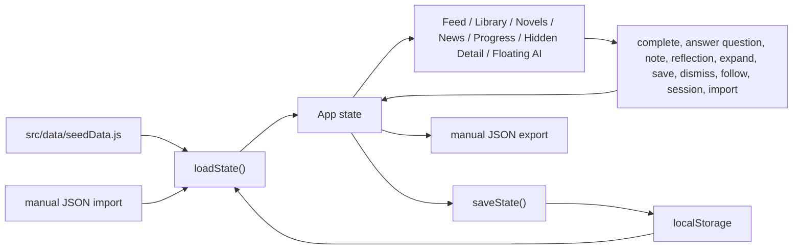
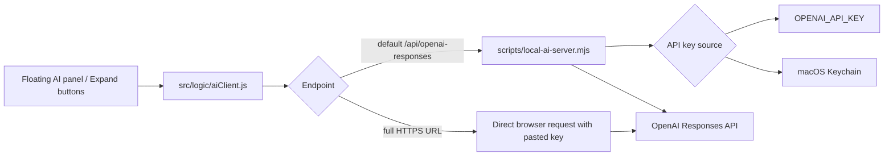
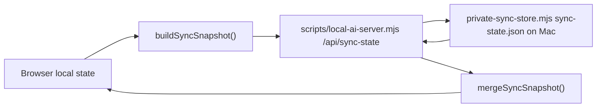

# Architecture

Leaderman is a Vite React single-page app with optional local Node tooling for private AI, private News, single-user sync, and desktop launching. The main product is intentionally static-first: it can run from GitHub Pages without a server, while the private server version runs from the user's Mac.

## Key Files

- `src/App.jsx`: main React application, Feed, navigation, shared item routing, Library, Novels, News, Progress, import/export controls, floating AI Coach UI, and local state updates.
- `src/styles.css`: full app styling, responsive layout, dashboard surfaces, controls, lesson cards, and mobile behavior.
- `src/data/seedData.js`: deterministic source cards, seeded lessons, initial progress records, and app state factory.
- `src/data/storage.js`: local state load/save, backup export, and backup import normalization.
- `src/data/topicBank.js`: subject and subtopic definitions plus deterministic lesson-to-topic indexing for Library.
- `src/data/newsStorage.js`: News storage, dedupe ledger, retention, saved story state, and expansion persistence.
- `src/data/syncState.js`: sync snapshot building and merge logic for the single-user private sync bridge.
- `src/data/aiSettings.js`: browser AI settings and optional browser-side key storage.
- `src/logic/reviewScheduler.js`: completion tracking and question-answer transitions.
- `src/logic/selectors.js`: source lookup and progress stats from the seeded lesson model.
- `src/logic/itemIdentity.js`: canonical keys for library, novels, and news items.
- `src/logic/itemRouting.js`: canonical item routing into shared detail views.
- `src/logic/feedAggregation.js`: Feed aggregation, scoring, domain interleaving, and reason-line generation.
- `src/logic/aiClient.js`: AI instructions, lesson context, Responses API payload construction, response parsing, and endpoint behavior.
- `scripts/local-ai-server.mjs`: static file server plus private OpenAI proxy, sync endpoints, news endpoints, and macOS Keychain saving.
- `scripts/private-sync-store.mjs`: sync snapshot file storage on the user's Mac.
- `scripts/private-news.mjs`: curated source fetching, clustering, summarization fallback, and News expansion helpers.
- `scripts/save-openai-key-to-keychain.mjs`: terminal-based Keychain setup.
- `scripts/create-mac-app.mjs`: creates the local macOS `Leaderman.app` launcher.
- `public/manifest.webmanifest`, `public/icon.svg`, `public/sw.js`: installable web app assets.
- `docs/`: generated GitHub Pages output from `npm run build:pages`.
- `project-docs/`: maintainable source documentation.

## Data Model

The app state is created by `createInitialState()` in `src/data/seedData.js`. The effective state shape is:

```js
{
  schemaVersion: 2,
  sources: SourceCard[],
  lessons: MicroLesson[],
  reviews: Record<lessonId, LessonProgress>,
  sessions: Session[],
  reflections: Reflection[],
  notes: Record<lessonId, string>,
  readingProgress: Record<lessonId, ReadingProgress>,
  lessonExpansions: Record<expansionKey, GeneratedExpansion>,
  followedTopics: Record<topicId, FollowState>,
  savedItems: Record<itemKey, SavedState>,
  dismissedItems: Record<itemKey, DismissState>,
  itemActivity: Record<itemKey, ActivityState>,
  news: NewsState,
  settings: object
}
```

`SourceCard` records explain where a lesson draws from:

```js
{
  id,
  title,
  author,
  domain,
  coreArgument,
  usefulIdea,
  blindSpot,
  opposingView,
  application,
  tags
}
```

`MicroLesson` records drive the learning experience:

```js
{
  id,
  slug,
  title,
  domain,
  sourceIds,
  sourceBasis,
  article,
  coreIdea,
  getsRight,
  misses,
  opposingView,
  historicalExample,
  scenario,
  decisionOptions,
  practiceRep,
  reflectionPrompt,
  reviewPrompt,
  ethicsCheck,
  agentNotes,
  order
}
```

`LessonProgress` is produced and updated by `src/logic/reviewScheduler.js`:

```js
{
  status,
  completed,
  completedAt,
  attempts,
  questionAttempts,
  correctAnswers,
  lastQuestionAt,
  lastReviewedAt
}
```

`Session` records capture completed five-card learning sessions:

```js
{
  id,
  startedAt,
  endedAt,
  lessonIds,
  results,
  minutes
}
```

Canonical items sit on top of the seeded lesson model:

```js
{
  key: 'library:lesson-id' | 'novels:lesson-id' | 'news:story-id',
  domain: 'library' | 'novels' | 'news',
  itemId: string
}
```

The Feed stores and routes canonical item keys, not a separate feed-only content type. `resolveCanonicalItemRoute(...)` maps those keys into the shared detail experience.

## State Flow



`lessonExpansions` stores local AI-generated Markdown drafts for expanded lessons, summaries, and authored chapter or section entries. News expansions live under the News state. These drafts are user-owned local data, not deterministic curriculum.

`loadState()` always keeps source cards and lessons from the current seed data. Imported or saved user state restores completion state, question-answer counts, notes, reflections, sessions, reading progress, lesson expansion drafts, saved items, followed topics, dismissed items, News state, and settings. This prevents stale exported curriculum from overwriting newer built-in curriculum.

## Feed Aggregation and Routing

`src/logic/feedAggregation.js` builds Feed entries from three canonical domains:

- Library lessons from `buildLibraryLessonIndex(...)`
- Novel and book lessons detected through `summaryKind === 'Novel'`
- Private News stories from `state.news.items`

Aggregation rules:

- direct-interest items are favored through saved state, follow state, and interaction history
- adjacent exploration fills the remaining space
- the target is roughly 80 percent direct interest and 20 percent adjacent exploration
- domain interleaving avoids long same-domain runs
- every card gets a plain-language reason line

The Feed does not own separate detail content. Opening a Feed item routes to the same underlying detail path as the native tab.

## Library and Novels

`src/data/topicBank.js` maps seeded lessons into a deterministic subject tree. This is intentionally curated and finite, not a marketplace. Current coverage is stronger in leadership, philosophy, history, business, writing, and politics than in emergency medicine or biopharm; those lower-coverage subjects exist in the topic model so they can be expanded without changing the architecture.

Novels are not a parallel content system. They are existing lesson records promoted into a separate tab and canonical domain, with reading progress and chapter summaries reused where available.

## News

News state lives in `src/data/newsStorage.js` and includes:

- `items`
- `topicLedger`
- `expansions`
- `refreshedAt`

The private server fetches source material from a small curated source list, then returns compact stories with:

- title
- category
- what happened
- sources

Saved or archived stories survive refresh and retention cleanup. Unsaved stories expire after 14 days. The topic ledger reduces repeated coverage of the same event.

Public GitHub Pages has no private News refresh path. The tab can still render stored local News state, but new refreshes require the private server.

## Progress Tracker

Progress is still intentionally simple. It reports percent complete, question percent right, completed card count, and recent reflection activity instead of a more elaborate mastery system.

## AI Flow



The default endpoint is `/api/openai-responses`. That only works when using the private local server. On GitHub Pages, the app can still run without AI, or the user can configure a direct HTTPS endpoint and provide a key in the browser.

The selected model is stored with AI settings. Curated model choices and descriptions live in `AI_MODEL_OPTIONS`; `DEFAULT_AI_SETTINGS.model` sets the default. The UI also supports a custom model ID.

The API request body includes a centralized `instructions` prompt. It gives the AI an overview of Leaderman, defines the tutor role, requires factual caveats, asks for examples and practical drills, and includes current lesson context when enabled.

Expansion requests use the same endpoint and key settings as AI Coach. The expansion prompt asks for structured Markdown, avoids repeated boilerplate, keeps source uncertainty separate from teaching content, and stores the result only in local or synced user-owned state.

News refresh follows a similar pattern, but it starts from fetched source material. The app should never ask the model to invent current events from memory. AI is used only to summarize, cluster, dedupe, and optionally expand actual fetched source material.

## Sync Flow



The sync bridge is intentionally small:

- single user
- no accounts
- no remote cloud backend
- no synced API keys
- best-effort last-write merge by per-slice timestamps plus periodic client pull and push

This is enough for one person using desktop and phone against the same Mac-hosted server, but it is not a multi-user conflict-resolution system.

## Build Outputs

`npm run build` creates `dist/` for local preview and private server use.

`npm run build:pages` creates `docs/` for GitHub Pages with `VITE_BASE=/leaderman/`. This folder is generated output and should be considered replaceable.

The desktop launcher does not bundle a copy of the app. It points to this repo path, runs `npm run build`, starts `scripts/local-ai-server.mjs`, and opens `http://127.0.0.1:4174/`.

## Testing

Current automated tests use Vitest and cover:

- AI settings behavior.
- AI chat persistence behavior.
- AI client payload and response parsing behavior.
- canonical item identity and routing.
- Feed aggregation and domain interleaving.
- completion and question-answer transitions.
- streak and session-minute helpers.
- seed data integrity.
- storage import and export normalization.
- topic bank indexing.
- News storage, retention, and dedupe behavior.
- sync snapshot build and merge behavior.

Run:

```bash
npm test
```

For UI changes, also run a build:

```bash
npm run build
```
