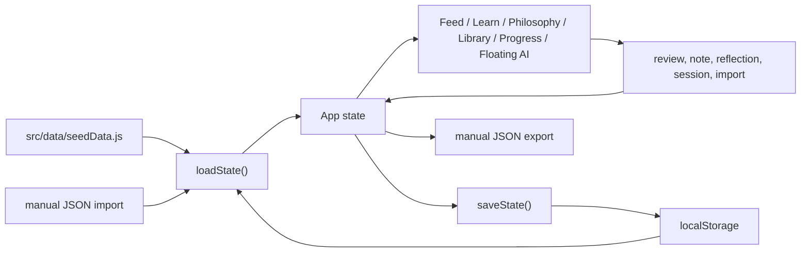
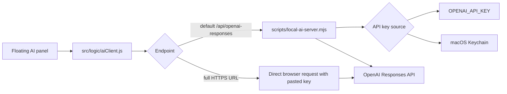

# Architecture

Leaderman is a Vite React single-page app with optional local Node tooling for private AI and desktop launching. The main product is intentionally static-first: it can run from GitHub Pages without a server, while the private AI version runs from the user's Mac.

## Key Files

- `src/App.jsx`: main React application, Feed, navigation, view composition, session flow, import/export controls, floating AI Coach UI, and local state updates.
- `src/styles.css`: full app styling, responsive layout, dashboard surfaces, controls, lesson cards, and mobile behavior.
- `src/data/seedData.js`: deterministic source cards, domains, philosophy schools, micro-lessons, initial reviews, and app state factory.
- `src/data/storage.js`: local state load/save, backup export, and backup import normalization.
- `src/data/aiSettings.js`: browser AI settings and optional browser-side key storage.
- `src/logic/reviewScheduler.js`: spaced-review date math and rating transitions.
- `src/logic/selectors.js`: due lessons, recommendations, source lookup, progress stats, and weak-domain sorting.
- `src/logic/aiClient.js`: AI instructions, lesson context, Responses API payload construction, response parsing, and endpoint behavior.
- `scripts/local-ai-server.mjs`: static file server plus private OpenAI proxy and macOS Keychain saving.
- `scripts/save-openai-key-to-keychain.mjs`: terminal-based Keychain setup.
- `scripts/create-mac-app.mjs`: creates the local macOS `Leaderman.app` launcher.
- `public/manifest.webmanifest`, `public/icon.svg`, `public/sw.js`: installable web app assets.
- `docs/`: generated GitHub Pages output from `npm run build:pages`.
- `project-docs/`: maintainable source documentation.

## Data Model

The app state is created by `createInitialState()` in `src/data/seedData.js`. The effective state shape is:

```js
{
  schemaVersion: 1,
  sources: SourceCard[],
  lessons: MicroLesson[],
  reviews: Record<lessonId, ReviewState>,
  sessions: Session[],
  reflections: Reflection[],
  notes: Record<lessonId, string>,
  settings: object
}
```

`SourceCard` records explain where a lesson draws from:

```js
{
  id,
  title,
  author,
  domain,
  coreArgument,
  usefulIdea,
  blindSpot,
  opposingView,
  application,
  tags
}
```

`MicroLesson` records drive the learning experience:

```js
{
  id,
  slug,
  title,
  domain,
  sourceIds,
  sourceBasis,
  article,
  coreIdea,
  getsRight,
  misses,
  opposingView,
  historicalExample,
  scenario,
  decisionOptions,
  practiceRep,
  reflectionPrompt,
  reviewPrompt,
  ethicsCheck,
  agentNotes,
  order
}
```

`ReviewState` is produced and updated by `src/logic/reviewScheduler.js`:

```js
{
  status,
  ease,
  intervalDays,
  dueAt,
  attempts,
  known,
  needsWork,
  lastReviewedAt
}
```

`Session` records capture completed five-card learning sessions:

```js
{
  id,
  startedAt,
  endedAt,
  lessonIds,
  results,
  minutes
}
```

## State Flow



`loadState()` always keeps source cards and lessons from the current seed data. Imported or saved user state restores progress, notes, reflections, sessions, reviews, and settings. This prevents stale exported curriculum from overwriting newer built-in curriculum.

## Review Scheduler

The review scheduler has three ratings:

- `Know it`: increases ease, expands the interval, and eventually marks the lesson `strong`.
- `Review later`: keeps the lesson in review and makes it due tomorrow.
- `Needs work`: lowers ease, keeps it due today, and marks it `needs-work`.

Due lessons are sorted by `src/logic/selectors.js`, with `needs-work` lessons first, then curriculum order.

## AI Flow



The default endpoint is `/api/openai-responses`. That only works when using the private local server. On GitHub Pages, the app can still run without AI, or the user can configure a direct HTTPS endpoint and provide a key in the browser.

The selected model is stored with AI settings. Curated model choices and descriptions live in `AI_MODEL_OPTIONS`; `DEFAULT_AI_SETTINGS.model` sets the default. The UI also supports a custom model ID.

The API request body includes a centralized `instructions` prompt. It gives the AI an overview of Leaderman, defines the tutor role, requires factual caveats, asks for examples and practical drills, and includes current lesson context when enabled.

## Build Outputs

`npm run build` creates `dist/` for local preview and private server use.

`npm run build:pages` creates `docs/` for GitHub Pages with `VITE_BASE=/leaderman/`. This folder is generated output and should be considered replaceable.

The desktop launcher does not bundle a copy of the app. It points to this repo path, runs `npm run build`, starts `scripts/local-ai-server.mjs`, and opens `http://127.0.0.1:4174/`.

## Testing

Current automated tests use Vitest and cover:

- AI settings behavior.
- AI chat persistence behavior.
- AI client payload and response parsing behavior.
- Feed queue ordering and domain interleaving.
- Review scheduler transitions.
- Streak and session-minute helpers.
- seed data integrity.
- storage import/export normalization.

Run:

```bash
npm test
```

For UI changes, also run a build:

```bash
npm run build
```
